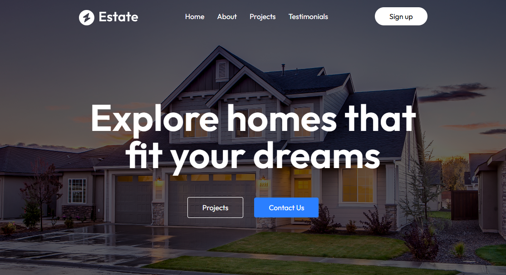
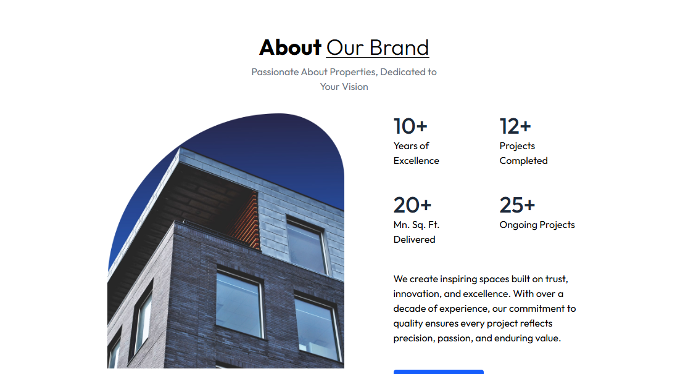
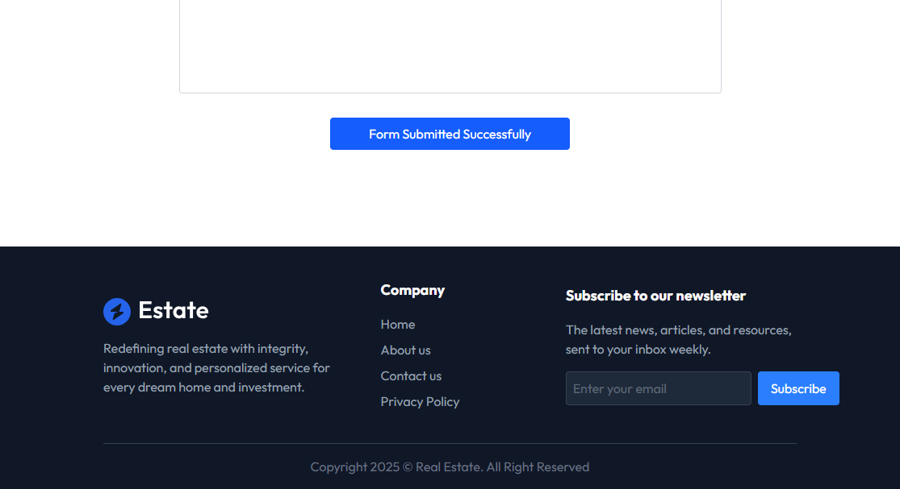

# 🏡 React RealEstate UI

A fully **responsive RealEstate frontend application** built with **React, Tailwind CSS, and Framer Motion**.
This project showcases property listings, interactive cards, sliders, and animations to provide a smooth and modern user experience.

---
## 🌐 Live Deployment

Experience the full application online here:  
[https://realestate-app.vercel.app/](https://real-estate-website-eta-gilt.vercel.app/)

---

## ✨ Features

⚡ **Animations**

* Smooth hover effects
* Framer Motion animations for sliders and modals
* Page transitions for a fluid experience

📱 **Responsive Design**

* Fully mobile-first layout with Tailwind breakpoints
* Optimized for tablets and desktops

🔧 **Customizable**

* Tailwind CSS classes for easy styling changes
* Framer Motion props for custom animations

---

## 📸 Screenshots

<div align="center">
   &emsp;
   &emsp;
   &emsp;
   &emsp;
   &emsp;
</div>

---

## 🚀 Getting Started

Clone this repo and explore the application.

### ▶️ Run Project

```bash
cd RealEstate
npm install
npm run dev
```

---

## 🛠️ Tech Stack

* **React** – Component-based UI library
* **Tailwind CSS** – Utility-first CSS framework
* **Framer Motion** – Animations and page transitions

---

## 🙋 Author

**Santhosh Kumar P S**

📧 Email: [santhoshkumarsakthi2003@gmail.com](mailto:santhoshkumarsakthi2003@gmail.com)

💻 GitHub: [SanthoshKumar-PS](https://github.com/SanthoshKumar-PS)
------------------------------------------------------------------
